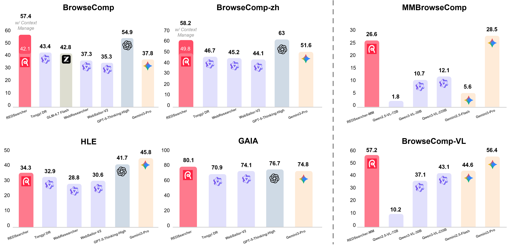

<p align="center">
    
<p>
<h1 align="center"> REDSearcher: A Scalable and Cost-Efficient
Framework for Long-Horizon Search Agents </a></h1>

The official repo for "REDSearcher: A Scalable and Cost-Efficient
Framework for Long-Horizon Search Agents".
<!-- [](http://arxiv.org/abs/2602.xxxxx) -->

<p align="center">
<!--  -->
📃 <a href="https://redsearchagent.github.io/">Project Page</a>
</p> 


<p align="center">
       🤗 <a href="https://huggingface.co/collections/Zchu/redsearcher">RedSearcher Collections</a>&nbsp&nbsp | &nbsp&nbsp🤗 <a href="https://huggingface.co/datasets/Zchu/REDSearcher_SFT_10K">SFT Dataset (Text)</a>&nbsp&nbsp | &nbsp&nbsp🤗 <a href="https://huggingface.co/datasets/Zchu/REDSearcher_RL_1K">RL Dataset Demo (Text) </a>&nbsp&nbsp | &nbsp&nbsp🤗 <a href="https://huggingface.co/datasets/honglyhly/REDSearcher_MM_SFT_5K">SFT Dataset (MM)</a>
</p>

<p align="center">
       🤗 <a href="https://huggingface.co/collections/Zchu/redsearcher">REDSearcher-30B-A3B (SFT+RL, coming soon)</a>&nbsp&nbsp | &nbsp&nbsp🤗 <a href="https://huggingface.co/collections/Zchu/redsearcher">REDSearcher-MM-30B-A3B (SFT+RL, coming soon)</a>&nbsp&nbsp 
</p>

<p align="center">
  📑<a href="https://arxiv.org/abs/xxxxxx"> REDSearcher Paper</a>
</p>

We will release the SFT data, RL data, SFT code, RL code, evaluation code, and model weights. Stay tuned for update!

## Timeline
- [2026/02/14] **We released [SFT Dataset (text)](https://huggingface.co/datasets/Zchu/REDSearcher_SFT_10K), [RL Dataset Demo (text)](), [SFT Dataset (MM)](https://huggingface.co/datasets/honglyhly/REDSearcher_MM_SFT_5K)**!


## Overview

**REDSearcher** integrates expert-level query synthesis, capability mid-training, and SFT/RL post-training for scalable search-agent development:

- **Complex Task Synthesis**: Dual-constrained optimization based on graph topology and evidence dispersion
- **Tool-Augmented Queries**: Encouraging proactive tool use over passive recall
- **Mid-Training**: Strengthening core atomic capabilities and agentic capabilities (knowledge, planning, function calling, long-horizon interaction)
- **RL-based Post-Training**: Leveraging a local simulated environment for rapid algorithmic iteration and large-scale reinforcement learning to enhance search performance

## Performance



### Quickstart

> **Coming soon** – Detailed quickstart guide will be added in a future update. Stay tuned!

### Environment Setup

> **Coming soon** – Installation instructions and environment setup will be added in a future update.

### Data Processing

#### SFT Data 

Our text-only SFT dataset (10K trajectories) and multi-modal SFT dataset (5K) is available on [Hugging Face](https://huggingface.co/datasets/Zchu/REDSearcher_SFT_10K). The data is formatted in **ShareGPT** format and can be directly used with [ms-swift](https://github.com/modelscope/ms-swift):

```python
from datasets import load_dataset

dataset_text = load_dataset("Zchu/REDSearcher_SFT_10K")
dataset_mm = load_dataset("honglyhly/REDSearcher_MM_SFT_5K")
```

#### RL Data

Our RL dataset is available on [Hugging Face](https://huggingface.co/datasets/Zchu/REDSearcher_RL_1K). To use with [Slime](https://github.com/THUDM/slime), convert the data to the required format where each sample contains `"prompt"` (messages including system prompt) and `"label"` (answer):

```python
from datasets import load_dataset

dataset = load_dataset("Zchu/REDSearcher_RL")
```

### Train

#### SFT 

> **Coming soon** – SFT training scripts and instructions will be added in a future update. Our SFT implementation is based on [ms-swift](https://github.com/modelscope/ms-swift).

#### RL

> **Coming soon** – RL training scripts and instructions will be added in a future update. Our RL implementation is based on [Slime](https://github.com/THUDM/slime).

### Eval

> **Coming soon** – Evaluation scripts and instructions will be added in a future update.

## Star History

[](https://www.star-history.com/#RedSearchAgent/REDSearcher&type=date&legend=top-left)


## Citation

```
@article{redsearcher2026,
  title={REDSearcher: A Scalable and Cost-Efficient Framework for Long-Horizon Search Agents},
  author={Zheng Chu and Xiao Wang and Jack Hong and Huiming Fan and Yuqi Huang and Yue Yang and Guohai Xu and Shengchao Hu and Dongdong Kuang and Chenxiao Zhao and Cheng Xiang and Ming Liu and Bing Qin and Xing Yu},
  journal={arXiv preprint arXiv:XXXX.XXXXX},
  year={2026}
}
```
